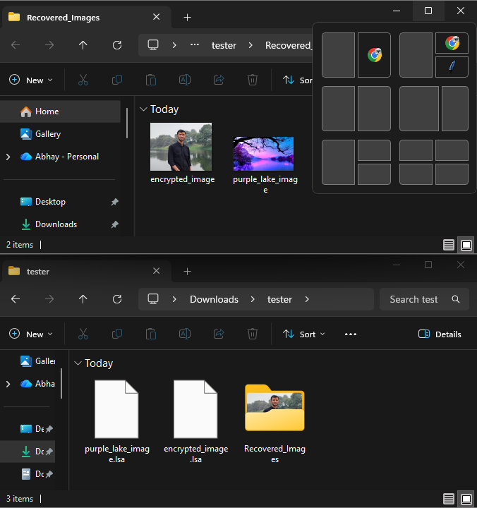

# LSA Image Recovery Tool v1.0.0

A Python GUI application for recovering encrypted `.lsa` image files from Xiaomi/Redmi devices.

## Features

- Bulk recovery of `.lsa` files
- Automatic image type detection
- Simple GUI interface
- Supports JPG, PNG, GIF and BMP
- Recover hundreds of files at once

## Requirements

```bash
pip install -r requirements.txt
```

## Run

```bash
python lsa_recovery_app.py
```

## Project Structure

```text
LSA-Image-Recovery/
│
├── .gitignore
├── LICENSE
├── README.md
├── requirements.txt
├── lsa_recovery_app.py
│
└── screenshots/
    ├── home page.png
    ├── select folder.png
    ├── decryption result.png
    └── output.png
```

## Screenshots

### Home Page


### Select Folder


### Decryption Result


### Output Folder



## Disclaimer

This tool is intended for recovering your own backed-up images from Xiaomi/Redmi devices.

The decryption method was tested on files recovered from a Redmi 9 Power device. Compatibility with other Xiaomi/Redmi devices or MIUI versions may vary.

## License

MIT License
